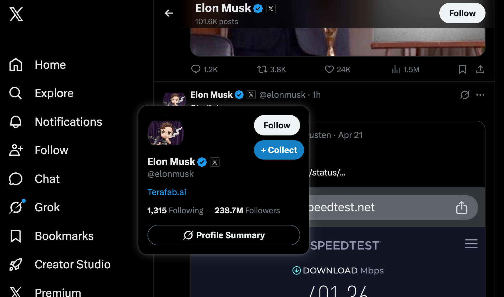
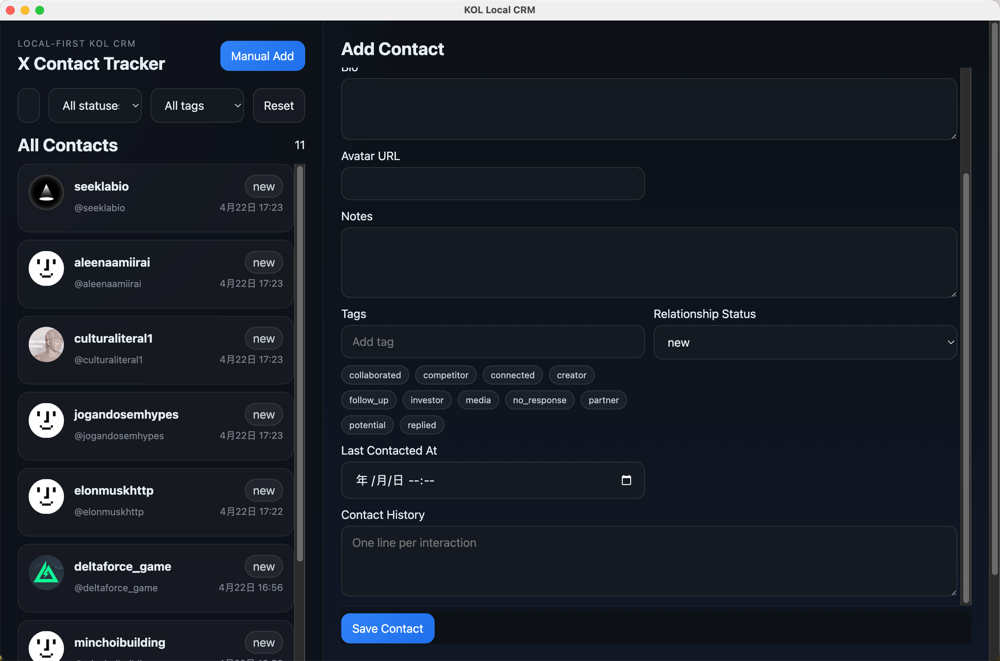
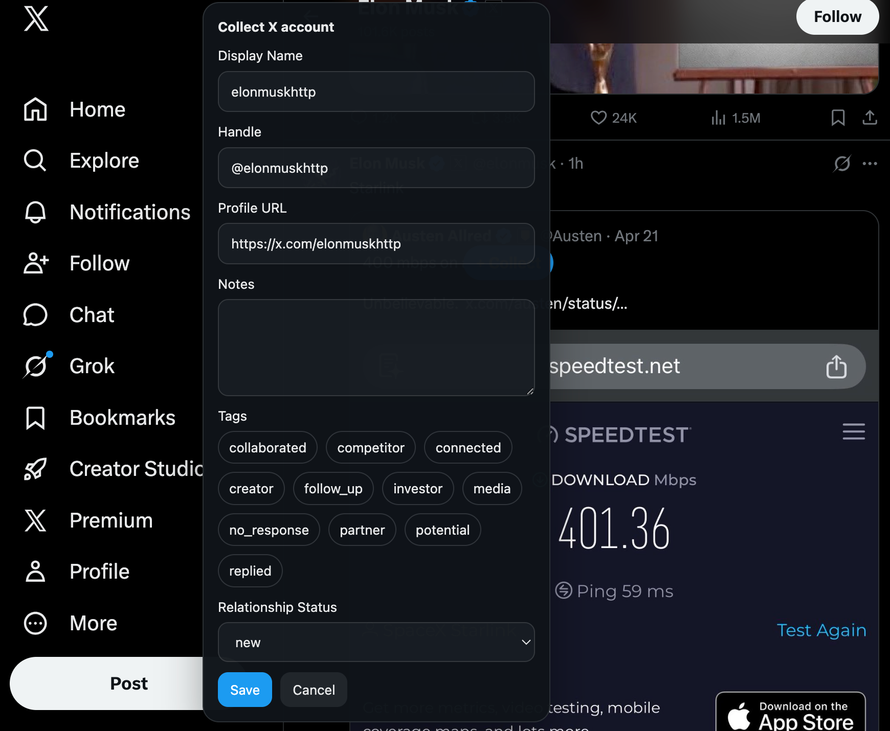

# KOL Local CRM

Local-first X account collection and relationship tracking built as:

- an Electron desktop app with React UI
- a local SQLite database
- a lightweight localhost bridge on `http://127.0.0.1:43112`
- a Chrome extension for quick collection on `x.com`

## MVP phases implemented

### Phase 1
- desktop app shell
- SQLite schema and CRUD layer
- manual add/edit contact form
- contact list with detail panel

### Phase 2
- Chrome extension content script
- layered X account extraction from links/cards/user cells
- hover quick-collect button
- compact popup save form
- save to desktop app through localhost bridge

### Phase 3
- duplicate detection by normalized handle
- search
- filter by tag
- filter by relationship status
- duplicate update flow
- basic error states

## Project structure

```text
kol admin/
  chrome-extension/
    manifest.json
    content.css
    content.js
  electron/
    main.js
    preload.js
    server.js
    store.js
  src/
    components/
      ContactForm.jsx
      ContactList.jsx
      Filters.jsx
      TagInput.jsx
    lib/
      api.js
    App.jsx
    constants.js
    main.jsx
    styles.css
  index.html
  package.json
  vite.config.js
  README.md
```

## Local database schema

The desktop app creates a SQLite database in Electron's user data directory with a `contacts` table:

- `id TEXT PRIMARY KEY`
- `platform TEXT NOT NULL DEFAULT 'x'`
- `display_name TEXT NOT NULL`
- `handle TEXT NOT NULL UNIQUE`
- `profile_url TEXT NOT NULL`
- `bio TEXT`
- `avatar_url TEXT`
- `notes TEXT`
- `tags TEXT` JSON array
- `relationship_status TEXT`
- `created_at TEXT`
- `updated_at TEXT`
- `last_contacted_at TEXT`
- `contact_history TEXT` JSON array

## Setup

1. Install Node.js 20+.
2. In the project directory, run:

```bash
npm install
```

## Run locally

Start the desktop app and renderer together:

```bash
npm run dev
```

This starts:

- the React renderer at `http://127.0.0.1:5173`
- the Electron desktop app
- the local bridge inside Electron at `http://127.0.0.1:43112`

The Chrome extension depends on the Electron app running because the bridge is hosted by the desktop process.

## Load the Chrome extension

1. Open Chrome and go to `chrome://extensions`
2. Enable `Developer mode`
3. Click `Load unpacked`
4. Select the `chrome-extension` folder
5. Keep the desktop app running while browsing `x.com`

## How extension and desktop app communicate

The extension sends HTTP requests to the local bridge:

- `GET /contacts/filters`
- `POST /contacts/upsert`

The Electron process owns the SQLite database and exposes those endpoints with Express on localhost only.

## Development packaging

Build the renderer and package the desktop app for development inspection:

```bash
npm run build
```
## Screenshots

### Quick collect from X


### Desktop contact detail


### Tag and status editing


Electron Builder is configured to output a macOS unpacked app directory target.

## Current behavior

### Desktop app
- manual add contact
- edit contact
- search by name, handle, notes, bio
- filter by tag
- filter by relationship status
- open X profile
- duplicate detection on handle
- created/updated/contact-history fields in storage

### Chrome extension
- detects likely X profile/account areas via layered DOM extraction
- shows a small floating collect button on hover
- opens a compact save form
- pre-fills collected account information
- saves to the local bridge
- merges into an existing contact if the handle already exists

## Optional next steps

- export/import CSV
- richer interaction timeline UI
- follow-up reminders
- keyboard shortcuts for quick collect
- stronger X DOM heuristics for more account card variants
- desktop app notifications when extension saves a contact
```
